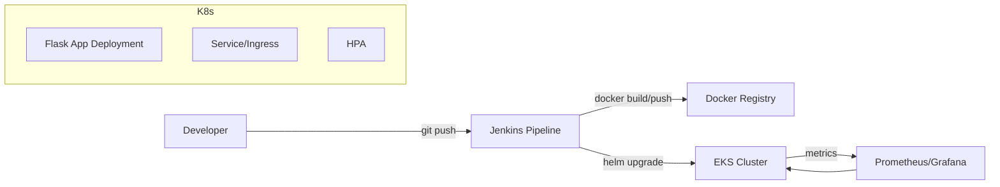

# FlaskOps – CI/CD for Flask on Kubernetes (EKS)

[]()
[]()
[]()
[]()

FlaskOps is a **production‑style DevOps project** that automates the full lifecycle — **build → test → push → deploy → observe → scale** — for a Flask application running on **AWS EKS**.  
It demonstrates a cohesive use of **Jenkins**, **Terraform**, **Docker**, **Helm**, **Prometheus/Grafana**, and **Kubernetes HPA**.

---

## 🔭 Highlights
- **Terraform** provisions: VPC, EKS, IAM, S3 (artifacts/logs), DynamoDB (state/indexing).
- **Jenkins Pipeline**: checkout → build → unit + Selenium E2E → push → Helm deploy to EKS.
- **Helm Chart** with env‑specific values, probes, and rolling updates.
- **Observability**: Prometheus scraping + Grafana dashboards (local docker‑compose).
- **Autoscaling**: HPA driven by CPU (and ready to extend to custom metrics).
- **Makefile** for repeatable developer workflows.

---

## 🧩 Tech Stack

| Category       | Technology                | Notes |
|----------------|---------------------------|-------|
| App            | Flask (Python)            | REST API, health endpoint |
| CI/CD          | Jenkins (multistage)      | Declarative pipeline + artifacts |
| IaC            | Terraform                  | EKS, VPC, IAM, S3, DynamoDB |
| Containers     | Docker                     | Multi‑stage build, lightweight image |
| Orchestration  | Kubernetes (AWS EKS)      | Managed control plane |
| Deployment     | Helm                       | One chart with env overlays |
| Monitoring     | Prometheus & Grafana       | Local docker‑compose (quick start) |
| Scaling        | HPA                         | CPU‑based autoscaling |
| Testing        | Selenium + pytest          | E2E + unit tests |

---

## 🗺️ Architecture



> You can also include a PNG/SVG diagram under `docs/architecture.png` and reference it here.

---

## 🗂️ Folder Structure

```text
FlaskOps/
├── app/                           # Flask application
│   ├── src/
│   ├── tests_unit/
│   └── requirements.txt
├── docker/
│   ├── app.Dockerfile
│   └── jenkins-agent.Dockerfile
├── ci/
│   └── jenkins/
│       └── Jenkinsfile
├── infra/
│   ├── terraform/
│   │   ├── modules/
│   │   │   ├── vpc/
│   │   │   ├── eks/
│   │   │   ├── iam/
│   │   │   ├── s3/
│   │   │   └── dynamodb/
│   │   └── envs/
│   │       └── prod/
│   │           ├── main.tf
│   │           ├── variables.tf
│   │           ├── outputs.tf
│   │           └── backend.tf
│   └── helm/
│       └── flaskops/              # Chart.yaml, values*.yaml, templates/
├── monitoring/
│   ├── docker-compose.yml         # Prometheus + Grafana (local)
│   └── grafana-dashboards/
├── tests/
│   └── selenium/
│       ├── conftest.py
│       └── test_e2e.py
├── scripts/
│   ├── deploy.sh
│   ├── rollback.sh
│   └── port-forward.sh
├── Makefile
├── .env.example
└── README.md
```

**Folder notes (tl;dr):**
- `app/` — Flask code + unit tests.
- `docker/` — Dockerfiles for app and Jenkins agent.
- `ci/jenkins/` — declarative pipeline (`Jenkinsfile`).  
- `infra/terraform/` — infra as code, split to **modules** and **envs**.  
- `infra/helm/flaskops/` — Helm chart with `values.yaml` & `values-prod.yaml`.  
- `monitoring/` — local Prometheus & Grafana.  
- `tests/selenium/` — E2E tests.  
- `scripts/` — helpers (deploy/rollback/port‑forward).  
- `Makefile` — repeatable commands.  
- `.env.example` — required env vars (copy to `.env`).

---

## ✅ Prerequisites
- Docker
- Terraform
- kubectl + AWS CLI (configured with suitable IAM)
- Helm
- Jenkins (controller + agent image from `docker/jenkins-agent.Dockerfile`)
- (Optional) Docker Compose for local monitoring

---

## ⚡ Quickstart

### 1) Provision AWS (prod)
```bash
cd infra/terraform/envs/prod
terraform init
terraform apply -auto-approve
```

### 2) Build & Push the App Image
```bash
make docker-build
make docker-push
# OR
docker build -f docker/app.Dockerfile -t <registry>/<repo>:<tag> .
docker push <registry>/<repo>:<tag>
```

### 3) Deploy to EKS (Helm)
```bash
kubectl config use-context <your-eks-context>
helm upgrade --install flaskops infra/helm/flaskops -n flaskops   -f infra/helm/flaskops/values.yaml   --create-namespace   --set image.repository=<registry>/<repo>   --set image.tag=<tag>
```

### 4) Port‑Forward & Smoke Test
```bash
./scripts/port-forward.sh
curl -s http://localhost:5000/health
```

### 5) Local Monitoring (optional)
```bash
cd monitoring
docker compose up -d
# Grafana -> http://localhost:3000  |  Prometheus -> http://localhost:9090
```

---

## 🧪 CI/CD (Jenkins)

**Pipeline stages (suggested):**
1. **Checkout**: Git clone + restore cache.
2. **Build**: Docker multi‑stage build (fast, minimal image).
3. **Unit Tests**: `pytest` for `app/tests_unit` (report as JUnit).
4. **E2E (Selenium)**: spin test container(s), publish HTML reports.
5. **Push**: Push image to Docker registry.
6. **Deploy**: `helm upgrade --install` to EKS.
7. **Post**: Notify + archive artifacts to S3.

> Keep pipeline & creds in Jenkins credentials store. Never commit secrets.

---

## ⚙️ Configuration
- **Env vars**: copy `.env.example` → `.env` and fill Docker registry + AWS creds.
- **Secrets**: use K8s Secrets via Helm template (`templates/secret.yaml`).
- **Values**: adjust `values.yaml` (and `values-prod.yaml`) for replicas, resources, image repo/tag, probes, and HPA thresholds.

---

## 📈 Scaling & Reliability
- **HPA**: CPU‑based autoscaling (can extend to custom metrics).
- **Probes**: readiness & liveness probes configured in Deployment.
- **Rollouts**: rolling updates with surge/unavailable limits; `rollback.sh` helper script.

---

## 🧰 Makefile (excerpt)

```make
APP=flaskops
IMAGE?=your-dockerhub/$(APP):$(shell git rev-parse --short HEAD)

docker-build:
	docker build -f docker/app.Dockerfile -t $(IMAGE) .

docker-push:
	docker push $(IMAGE)

helm-deploy:
	helm upgrade --install $(APP) infra/helm/$(APP) -n $(APP) 	  -f infra/helm/$(APP)/values.yaml --set image.repository=$(IMAGE)

port-forward:
	kubectl -n $(APP) port-forward svc/$(APP) 5000:80
```

---

## 🧯 Troubleshooting
- **Pods Pending** → check node groups / IAM / CNI limits.  
- **CrashLoopBackOff** → `kubectl logs -f deploy/flaskops` + inspect probes.  
- **No metrics for HPA** → ensure metrics‑server on cluster or Prometheus adapter.  
- **Cannot pull image** → verify registry creds & image tag in values.

---

## 🗺️ Roadmap
- GitHub Actions mirror of the Jenkins pipeline
- GitOps (ArgoCD or Helmfile)
- Loki for centralized logs + alerting to Slack
- Synthetic tests job post‑deploy

---

## 📄 License
MIT

---
## 💬 Contact

For suggestions, improvements, or collaboration:
- 📧 [Sivmarom@gmail.com](mailto:Sivmarom@gmail.com)
- 🔗 [LinkedIn](https://www.linkedin.com/in/sivan-marom/)
- 💻 [GitHub](https://github.com/sivanmarom)

---
